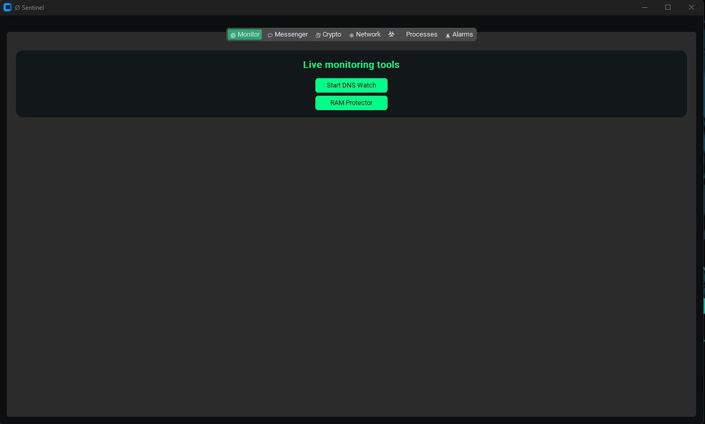
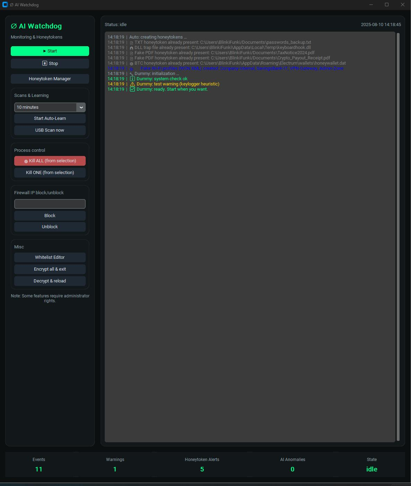
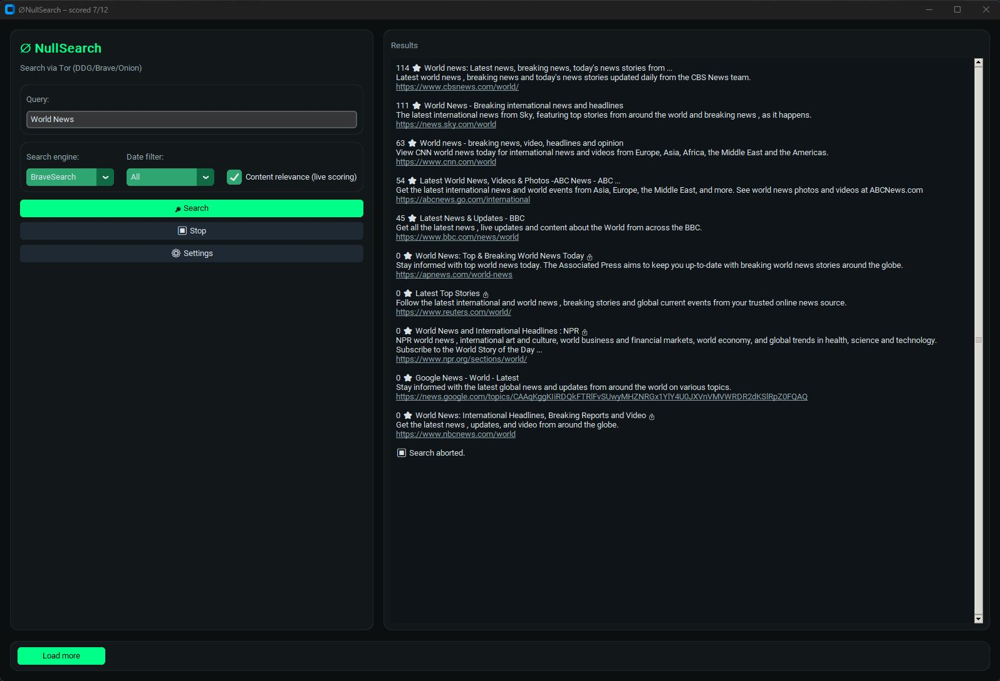
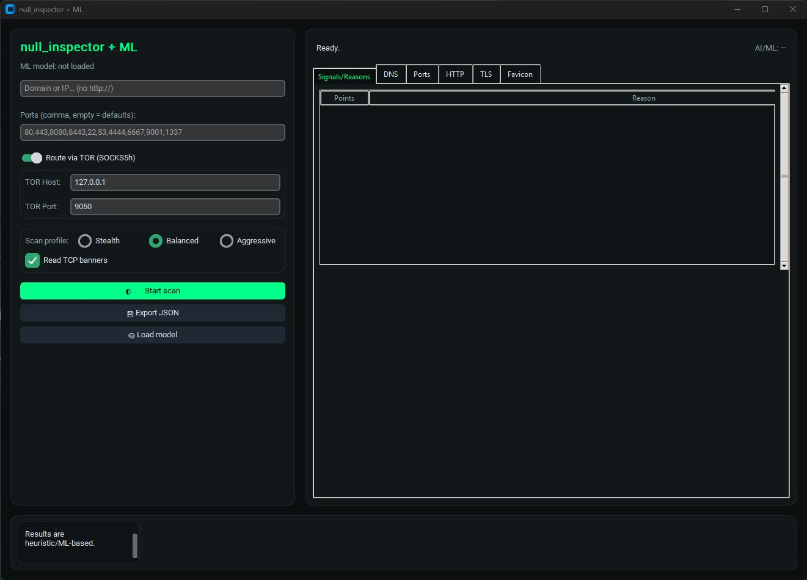
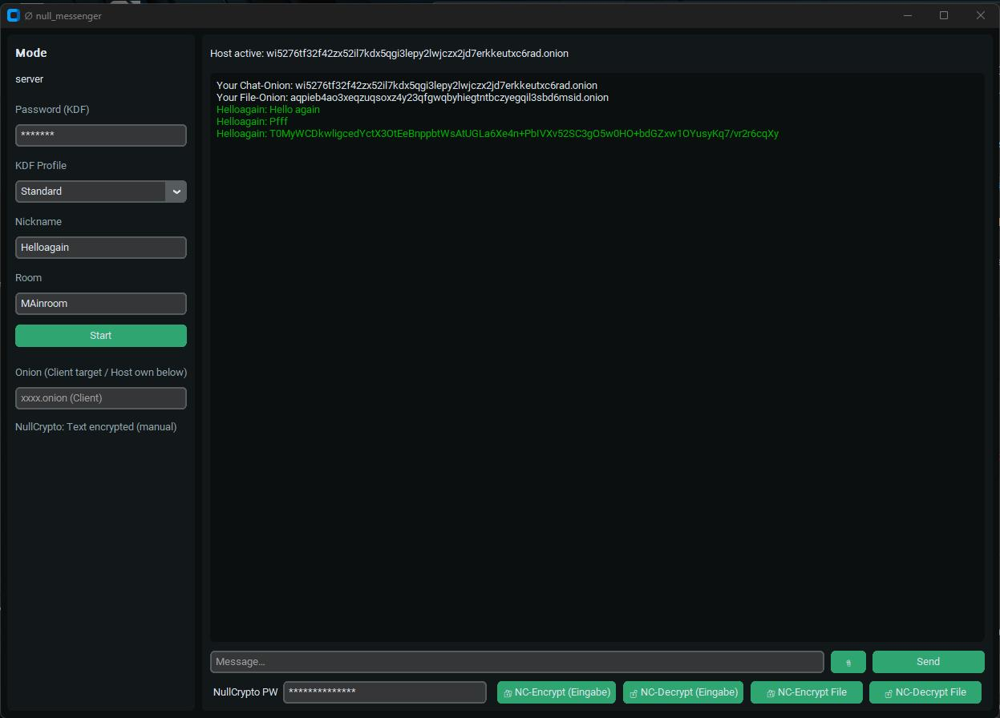
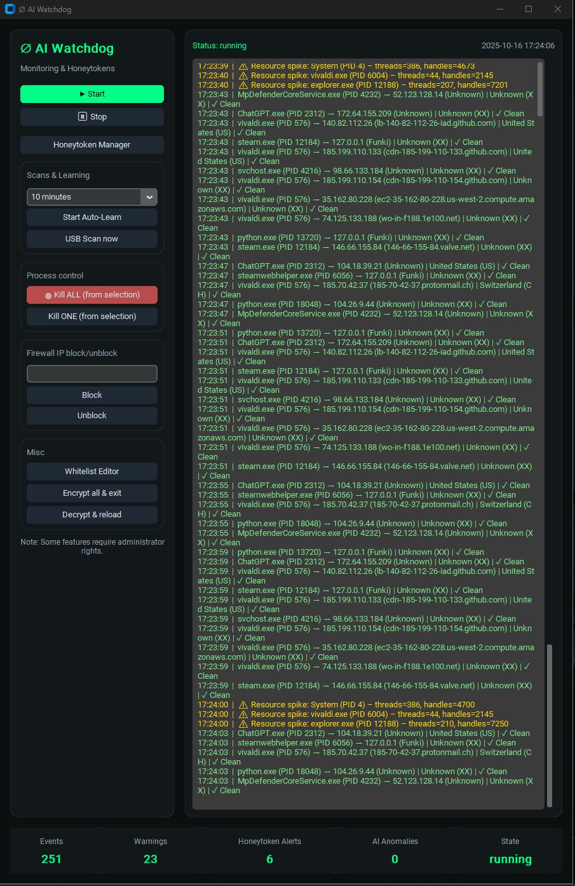
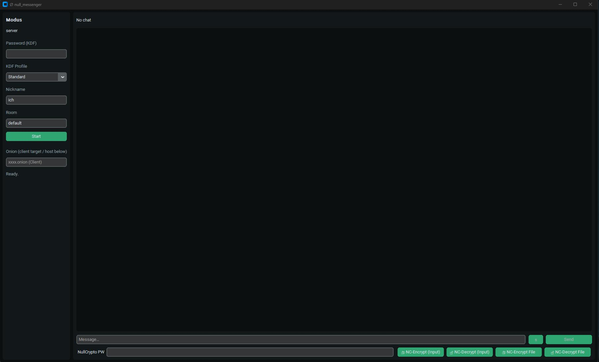

# Privacy Security Suite - From Amiga to AI

## Overview
The Privacy Security Suite is a **fully modular, local-first security toolkit** designed for individuals, researchers, activists, and organizations who value **privacy, independence, and control over their data**.

Built with decades of experience — from the **Amiga 500 era** to modern **AI-powered defense** — this suite is a statement against mass surveillance, cloud dependency, and big tech data mining.

---

## Why I Built This
I've been in tech since the age of 8, growing up with C64, Amiga, 386/486 PCs, and the birth of the internet.  
I have seen the transformation from **open, free computing** to a world where our data is constantly harvested by corporations and governments.

This suite was built as **digital self-defense**:
- Against mass surveillance
- Against state-controlled censorship
- Against forced cloud dependency
- For true freedom in the digital space

I don't want to choose between *"USA or China controlling my data"* — I want to keep it **myself**.

---

## Key Features
- **Full modular design**: Network scanning, process guarding, DNS monitoring, firewall visualization, file integrity monitoring, encrypted messenger, and more.
- **Privacy-first**: No forced cloud connections. 100% local processing.
- **TOR support**: Optional TOR routing for scans and communication.
- **Safe defaults**: Conservative scanning profiles, rate-limiting, IPv6 ready.
- **GUI-driven**: Dark-theme interface, central launcher, easy to use.
- **Fallback modes**: Works even with missing optional dependencies.

---

## How It Works
The suite is **modular** — each tool handles a specific security domain, but all can work together:

- **AI Watchdog** → Monitors processes, detects anomalies, alerts the user.
- **NetMon** → Live network traffic monitoring with protocol breakdowns.
- **Network Scanner** → Detects hosts, services, vulnerabilities.
- **DNS Watcher** → Detects suspicious DNS changes, blocking known trackers.
- **Firewall Visualizer** → Shows real-time block/allow rules in a visual map.
- **Crypto Tool** → Encrypt/decrypt sensitive files locally.
- **Messenger** → Peer-to-peer encrypted chat without central servers.

---

## Example Workflows
### 🛡 Activist in a Censored Country
1. Launch the suite with TOR enabled.
2. Use the encrypted messenger to communicate securely.
3. Run DNS Watcher to detect DNS hijacking.
4. Use AI Watchdog to monitor for local spyware.

### 🏢 Securing a Small Business Network
1. Use the network scanner to audit all connected devices.
2. Enable NetMon to watch for unusual outbound traffic.
3. Use Firewall Visualizer to tighten rules.
4. Run file integrity monitoring on sensitive company documents.

---

## TOR Setup Guide
1. **Install TOR**  
   - Linux: `sudo apt install tor`
   - Windows: Install the [Tor Expert Bundle](https://www.torproject.org/download/tor/)
2. **Start TOR**  
   - Linux: `sudo systemctl start tor`
   - Windows: Run `tor.exe`
3. **Configure Suite**  
   - Open settings in the launcher.
   - Enable **"Route traffic via TOR"**.

---

## Feature Comparison

| Feature / Criteria | **This Suite** | Typical GitHub Security Tools |
|--------------------|----------------|--------------------------------|
| **Integration** | ✅ Full modular suite (Watchdog, Scanner, DNS, Firewall, Crypto, Messenger) | ❌ Usually single-purpose scripts |
| **Platform** | ✅ Local Python app with full GUI | ❌ Mostly CLI or server-only |
| **Privacy** | ✅ 100% local processing, TOR support, no cloud dependency | ❌ Often requires API keys, sends data to cloud |
| **Network Coverage** | ✅ IPv4 + IPv6, TOR routing, stealth profiles, rate-limiting | ❌ Often IPv4-only, no TOR |
| **Security Scope** | ✅ Host + network + file monitoring combined | ❌ Usually one category only |
| **Fallbacks** | ✅ Works with reduced functionality if libs missing | ❌ Fails to run without all deps |
| **TLS/Cert Checks** | ✅ Expiry, anomaly detection, stapling hints | ❌ Rarely included |
| **Usability** | ✅ Consistent GUI, dark theme, launcher hub | ❌ Minimal UI or none |
| **Messaging** | ✅ Encrypted P2P messenger included | ❌ No integrated communication |
| **Customizability** | ✅ Modular design, easy to add new checks | ❌ Often hard-coded logic |
| **Security Defaults** | ✅ Safe profiles, conservative scanning | ❌ Often aggressive scans by default |
| **Target Audience** | ✅ Privacy users, researchers, activists, SMBs | ❌ Mostly devs & researchers |

---

## Legal Disclaimer
This software is intended **only** for defensive, educational, and research purposes.  
Never scan, monitor, or intrude on systems you do not own or have explicit permission to test.

---

## License
MIT License — see LICENSE file for details.

---

## Screenshots

### Sentinel (Main Monitoring Hub)

### AI Watchdog

### NullSearch (TOR-enabled search tool)

### Network Scanner / Inspector

### Null Messenger (Encrypted P2P Chat)

# Screenshots

Below is a quick tour of the main modules. All run locally with a consistent dark/green UI.

### Sentinel Launcher

Central entry point to start modules (Monitor, Messenger, Crypto, Network, Processes, Alarms).

### AI Watchdog

Honeytokens, process heuristics, optional ML anomaly detection, and quick firewall/IP actions.

### Nullsearch (Tor DuckDuckGo)

Onion-friendly search UI with filters and meta preview (routes via local Tor SOCKS if configured).

### Null Inspector / Scanner

Heuristic + optional ML scoring: DNS, ports, HTTP, TLS, favicon hash; TOR routing toggle.

### Null Messenger

Onion-based, password‑derived encryption (XChaCha20/Argon2id) + PFS per session, file transfer, rooms.

## Contact

For questions, suggestions, or **responsible disclosure** of security issues, please email **imaljonur@protonmail.com**.

_Note:_ I'm not online 24/7 — I'll reply when I can.

## 📸 Screenshots

